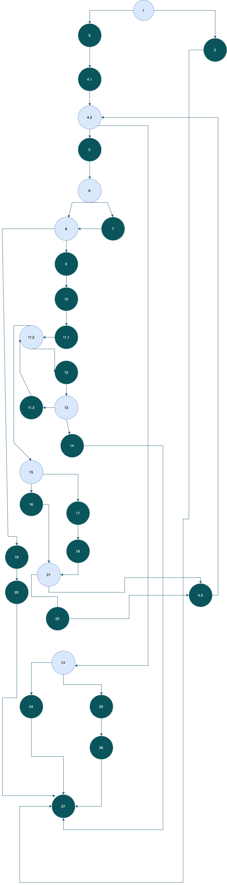

# SI_2024_lab2_223311
Eva Dimitrova 223311

Go napraviv grafot koristejki ja ovaa online alatka za crtanje na CFG grafovi https://app.diagrams.net/ 

za kodot kojsto bese postiran na courses ciklomatskata kompleksnost e 10, odnosno so 9  + 1predikatni jazli 

test cases spored kriteriumot Every Branch 
1: allItems = null prazna lista 
2: allItems = [] vrakja true
3: allItems = [new Item(null, "12345", 100, 0)] vrakja true ako if (item.getName() == null || item.getName().length() == 0)
4: allItems = [new Item("", "12345", 100, 0)] vakja true ako if (item.getName() == null || item.getName().length() == 0)
5: allItems = [new Item("item1", null, 100, 0)] frla exception if (item.getBarcode() != null)
5: allItems = [new Item("item1", "123a5", 100, 0)]frla except6ion ako if (allowed.indexOf(c) == -1)